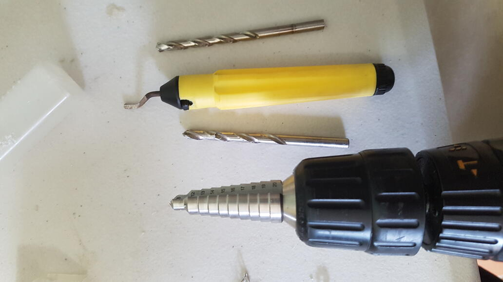
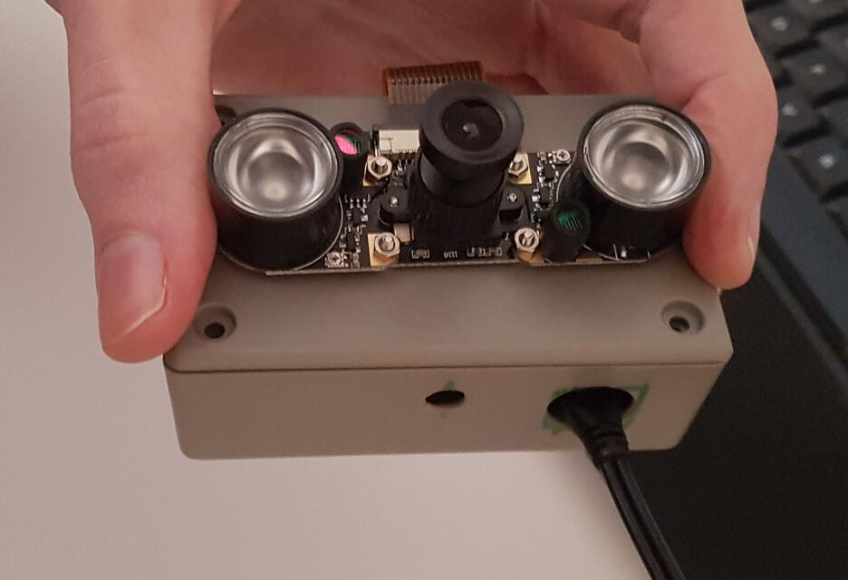
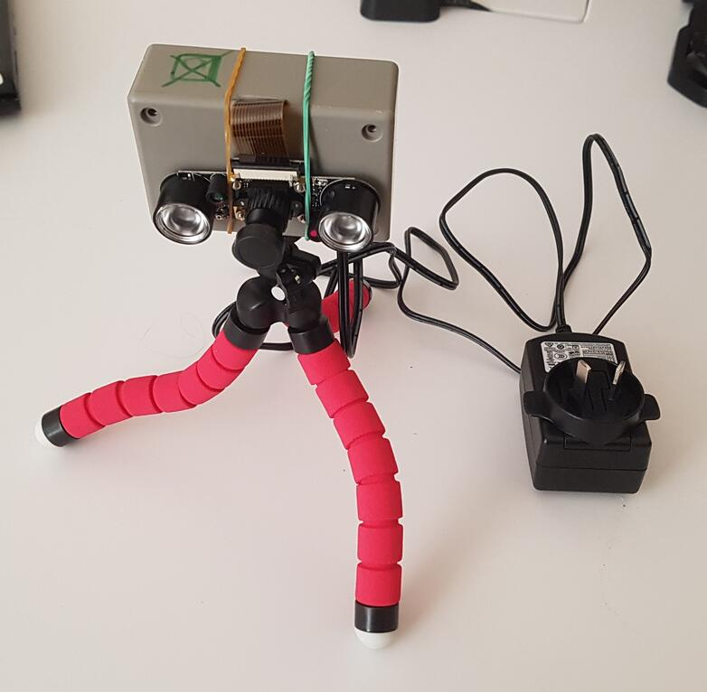

# How to build the pi cam v2

See the [readme](./readme.md) for the parts list.

# Tools needed
- drill
- approx 6mm drill bit
- hole-drilling bit (pictured below on the left), or large drill bit (12mm?)
- de-burring tool (pictured below, with the yellow handle)

# Procedure
- drill holes in one side of the jiffy box
    - one 6mm hole in the centre - this is for the tripod mount
    - one ~12mm hole to the right - this is for the power cable

- cut a hole for the camera cable: on the opposite side of the box to the
  drilled holes, mark a section as wide as the camera cable, then scrape away
  enough of the box for the camera cable to fit through when the jiffy box lid
  is attached. The hole is just visible at the top of the box in the image
  below:

- attach the tripod to the box, fixing it with the unc nut
- attach the camera cable to the raspberry pi, and place the pi in the box
- attach the power cable to the raspberry pi
- attach the lid of the jiffy box, feeding the camera cable through the hole
- attach the camera module to the lid of the jiffy box with double sided tape.
  To make sure it remains in place, add a couple of rubber bands around it and
  the box.
